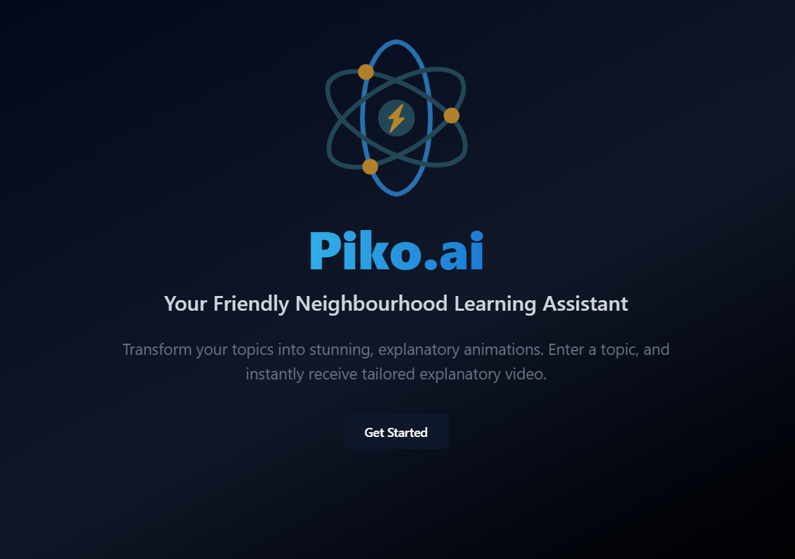
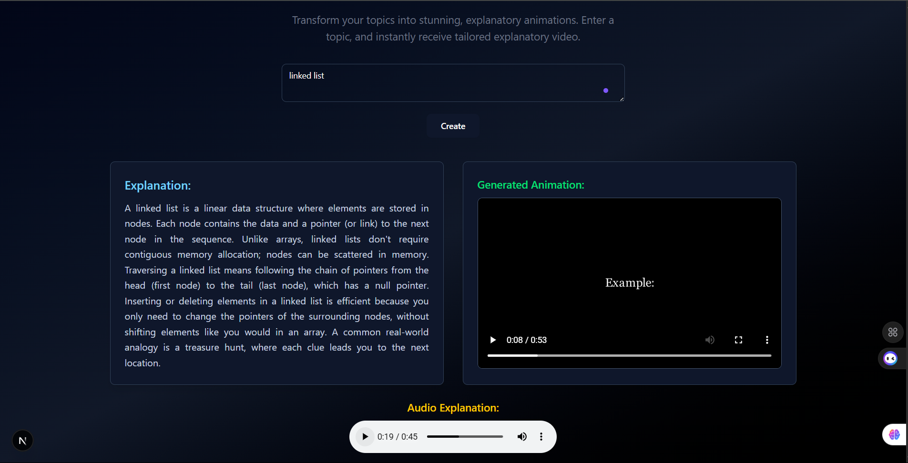

<h1 align="center">Piko.ai</h1>
<h3 align="center">Your Friendly Neighbourhood Learning Assistant</h3>

<p align="center">
  
  
  
</p>

**Piko.ai** is an AI-powered learning assistant that turns any topic into beautiful **Manim-based animations** and concise explanations — all from a simple prompt.

## 🚀 Features

- 🧠 **AI-Powered Animation Generation**  
  Enter a topic (e.g. “binary trees” or “rotational motion”), and instantly generate Manim code using Google's Gemini LLM.

- 🎬 **Automatic Video Compilation**  
  The generated Python code is saved, compiled using Manim CLI, and the output `.mp4` video is served automatically to the frontend.

- 📝 **Topic Explanation with LLM**  
  Along with the animation, a concise textual explanation is generated to help users understand the topic better.

- 🎧 **Audio Narration**  
  Support for accompanying `.wav` audio narration for enhanced understanding.

- 🌐 **Modern Frontend Experience**  
  Built with **Next.js**, **Tailwind CSS**, **Framer Motion**, and **ShadCN** for smooth UX, animations, and mobile responsiveness.


## 🖼️ Preview

| Landing Page | Generated Animation + Explanation |
|--------------|---------------------------|
|  |  |

For a video demo, click [here](./assets/Demo.mp4)
## 🛠️ Tech Stack

### 🔹 Frontend
- `Next.js 14` with App Router
- `Tailwind CSS` for styling
- `Framer Motion` for animations
- `ShadCN UI` for beautiful components

### 🔹 Backend
- `FastAPI` for API endpoints and routing
- `Google Gemini API` for code + explanation generation
- `Manim` CLI for compiling Python animations
- `StaticFiles` for serving media

---

## 🧪 How It Works

```mermaid
graph TD;
    User[User enters a topic] -->|POST /code/{topic}| FastAPI
    FastAPI -->|Prompt sent to Gemini| GeminiAPI
    GeminiAPI -->|Returns Python Manim code| FastAPI
    FastAPI -->|Saves & compiles with Manim| MP4[.mp4 Video]
    FastAPI -->|Returns explanation & video| Frontend
    Frontend -->|Plays video + shows explanation| User
```

## Running Locally

1. Clone & Setup Backend

```bash
git clone https://github.com/yourusername/piko-ai.git
python -m venv venv
source venv/bin/activate  # or venv\Scripts\activate on Windows
pip install -r requirements.txt
```

2. Run FastAPI server

```bash
uvicorn main:app --host 0.0.0.0 --port 8000
```

3. Setup Frontend

```bash
cd ../frontend
npm install
npm run dev
```

## Environment Variables

Create a .env file in the root folder:

```
GEMINI_API_KEY=your_google_gemini_api_key
```